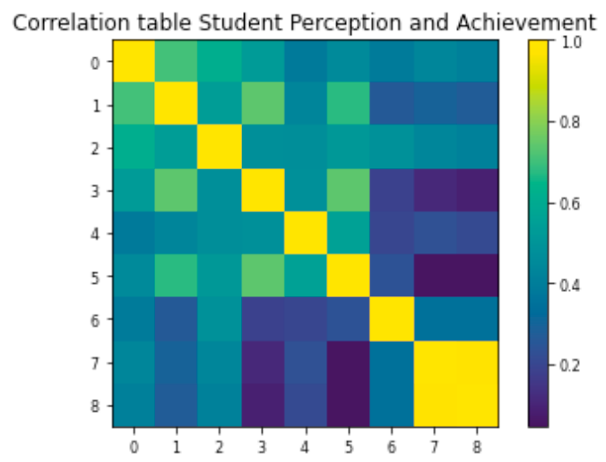

# NYC Elementary School Data Analysis

The following project was created as a final submission to Pascal Wallisch class *Intro to Data Science*.


In this project our primary focus revolves around examining whether specific characteristics associated with middle schools in NYC can serve as predictors for admission to one of the eight highly selective public high schools in the city, collectively known as HSPHS. It is important to highlight that admission to these esteemed schools necessitates not only the submission of an application but also achieving a high score on the Specialized High Schools Admissions Test (SHSAT), which is an externally developed and anonymously evaluated standardized test. Through this project, we aim to uncover valuable insights and explore the factors that may influence the admission process to these exceptional educational institutions.

#### Managing missing data

Due to imperfect data, I'll employ methods to address missing data in this project. NaN removal will be applied to necessary rows (schools) without removing all rows with >=1 nan, as our aim is to retain as much data as possible. Throughout the project, you'll observe the concatenation of smaller dataframes from the original data and the implementation of the nan-removal method on these subsets. For instance, when correlating column A with B in a dataset containing NaNs in columns A, B, and C, we'll group A and B before performing the action solely on those columns. This approach preserves rows where column C contains NaNs, rather than excluding them based on perfect data. Additionally, I utilize the nanRemover function for Numpy arrays, which is defined under section I of the appendix.


#### Determine which is a better predictor of admission to HSPHS: the raw number of applications or the application rate.

To ensure accurate analysis, schools with zero applicants were excluded from the calculation. This step was taken to avoid ambiguity, as schools with zero acceptances but non-zero applications may erroneously be considered similar to those with both zero applications and acceptances. Subsequently, two linear regression models were employed to predict admissions (Y) using the number of raw applications (x) and the application ratio (x) as predictors. The results revealed that raw applications proved to be a superior predictor, with a coefficient of determination (R^2) of 0.655 (represented by the blue line), compared to a coefficient of 0.440 for the application-rate model (represented by the red line). This suggests that the number of raw applications provides more meaningful insights in predicting admissions outcomes. Code can be found under II in the apendix.

 

#### Analyzing which school has the best per student odds of sending someone to HSPHS.

The ratio was calculated by examining the acceptances/school size ratio. The school with the highest per student odds HSPHS was Christa McAuliffe School with odds of 3.26 to 1 for sending someone to HSPHS. Code can be found under seciton III in the apendix.


#### Investigating the relationship between students' perception of their school (as reported in columns L-Q) and the school's performance on objective measures of achievement (as noted in columns V-X).

The first step to determining if there are any relationships worth investigating by plotting a correclation table:

 

Upon further analysis, it becomes evident that multiple correlations exist within the dataset, highlighting the need for dimension reduction. To address this, a two-dimensional Principal Component Analysis (PCA) will be conducted. Prior to conducting PCA, the data will be normalized to ensure consistency and comparability across variables.

 

To evaluate the Eigenvalues, the Kaiser criterion will be applied (1), represented by the red line. This criterion helps determine the significance of the factors. For both PCA analyses, one crucial factor is retained based on this criterion. Next, the scores of the two factor loadings will be examined:

 

When examining the loadings of Perception (shown in the left chart above), we observe four notable loadings that are of interest and warrant further analysis. These loadings correspond to Rigorous Instructions (1), Collaborative Teachers (2), Effective School Leadership (4), and Trust (6). Additionally, when investigating the loadings of student achievement (shown in the right chart), we identify one significant loading related to Reading Scores Exceeded (2). To analyze the variance among these loadings, an ANOVA is conducted, yielding the following table:


The results of our model regarding the interaction effects were not particularly informative, as they lacked significance, displayed low F-values, and had limited sums of squares. However, the main effects provide more interesting findings. Notably, trust, reading scores exceeding expectations, and rigorous instruction all exhibit significant p-values, accompanied by good F-values and sums of squares (although it should be noted that the loading for rigorous instruction was relatively low). Since our initial model did not yield any significant interaction effects, a decision was made to narrow down the analysis. Consequently, a follow-up ANOVA was conducted, excluding 'rigorous instruction' and 'effective school leadership' loadings, focusing instead on loadings with an absolute value of approximately 0.4. The resulting ANOVA table is as follows:


Upon analyzing the results, it becomes apparent that the significance of 'reading scores exceed' is greater than initially anticipated. Furthermore, the importance of 'trust' is confirmed as a significant factor. Additionally, an intriguing interaction effect emerges between 'collaborative teachers' and 'trust'. Based on these findings, it can be concluded that there is indeed a relationship between student perception and the measured variables. Although the strength of this relationship may not be as pronounced as the importance of reading scores, it is evident that perception does play a significant role. Code for this can be found in section IV of the appendix.


#### Testing the hypothesis whether if size of the school impacts the student's achievement.  

In this analysis, the school size is categorized into two groups, namely large and small, using the median as the dividing point. Subsequently, a scatter plot is generated to gain intuitive insights from the visual representation of the data.


Upon visual inspection, there appears to be no noticeable difference in achievement between small schools (represented in red) and large schools (represented in blue). However, to delve deeper into this observation, further investigation is warranted. The null hypothesis formulated is that school size does not impact student achievement. Before selecting an appropriate test to evaluate this null hypothesis, the normal distribution of the achievement variable is assessed.

 

The achievement variable appears to follow a normal distribution. Consequently, an independent t-test is conducted to compare the achievement levels of small schools and big schools. The resulting p-value is approximately 0.06517. Since this p-value exceeds the significance threshold, we are unable to reject the null hypothesis. Therefore, based on the statistical analysis, it can be concluded that the size of the school does not have a significant impact on student achievement. Code for this can be found in section V of the appendix.

#### Developing a model that includes all factors to identify the most important school characteristics for a) sending students to HSPHS, and b) achieving high scores on objective measures of achievement.

To develop a comprehensive model that incorporates all relevant factors, I first performed a dimension reduction step. The methodology used for this reduction is identical to that described in question 4. Although we have already analyzed the data extensively and identified potential correlations, it is essential to further confirm the presence of any correlations within the dataset. To achieve clarity, a correlation matrix was generated for the entire dataset, excluding the 'dbn' and 'name' columns. This analysis allows us to gain a holistic understanding of the data and validate any existing correlations.


To analyze the data further, we proceed by calculating the eigenvalues of our 21x21 matrix. From this calculation, we obtain five distinct loadings that are of particular interest and warrant further examination for interpretability:


And just as previously done, we now examine the seperate loadings:


    

Due to the high dimensionality of the data, it becomes challenging to comprehend the specific representation of each loading. To address this issue, a decision was made to construct two distinct unsupervised models using random forests. One model focuses on predicting the likelihood of students being accepted into HSPHS, while the other model aims to predict high scores on objective measures of achievement.

Both models were trained using separate training and test datasets, maintaining the same proportions of 80% for training and 20% for testing. This approach allows us to effectively determine and explain the feature importance for each dependent variable in their respective models.


During the model-building process, it was observed that varying the n_estimator parameter (number of trees) within the range of 100 to 1000 did not significantly affect the results. Therefore, for the sake of improved computational efficiency, the models were run with an n_estimator value of 100. Despite this adjustment, the interpretation of the models remains consistent, as the outcomes are evidently clear.

The first model underscores the importance of a supportive environment in driving student achievement, reaffirming our initial expectations. On the other hand, the second model emphasizes that raw application numbers hold the highest significance when attempting to predict the number of accepted students into HSPHS. These findings further support our understanding of the influential factors within the models and provide valuable insights for future analysis.

There are numerous insights to highlight in this analysis, emphasizing the complexity of real-world data. It is essential to acknowledge that if there were simple solutions, the issues at hand would not require extensive resolution efforts. That said, the various analyses conducted reveal significant findings.

Firstly, it has been consistently demonstrated that reading scores exceeding expectations play a crucial role as an indicator of student success. Additionally, the social environment surrounding students emerges as a paramount factor. The presence of a supportive environment is a key determinant of success, indicating that student well-being and engagement hold greater importance than solely relying on material resources.

While the availability of resources remains important, it is not the primary driver of student achievement. Notably, one of the most significant findings relates to smaller classroom sizes, suggesting that this factor intuitively provides more one-on-one time between teachers and students. Consequently, this improved teacher-student interaction contributes to fostering a supportive environment.

Overall, these findings underscore the intricate nature of the data and the multifaceted factors that contribute to student success. By focusing on student well-being, creating supportive environments, and optimizing classroom sizes, it is possible to cultivate an environment conducive to positive educational outcomes. All the code can be found in section IV of the appendix.

#### Summarize the findings to identify the school characteristics that appear most relevant in determining acceptance of their students to HSPHS.
Provide actionable recommendations to the New York City Department of Education on how to improve schools in terms of a) increasing the number of students sent to HSPHS, and b) enhancing objective measures of achievement.

a) The findings from our analysis, including linear regression and modeling, highlight the significant importance of the number of applications to highly selective public high schools (HSPHS) in determining acceptance. While it may seem obvious that applying is a prerequisite for acceptance, the prestigious nature of HSPHS schools can create barriers and discourage students from even considering applying. Therefore, creating a supportive environment that encourages and motivates students to pursue admission to HSPHS is crucial. This can be achieved through increased encouragement and guidance from teachers and the school community, fostering a culture that promotes aspirations towards HSPHS education. By instilling confidence and providing necessary support, students are more likely to apply, ultimately increasing their chances of acceptance.

b) In order to enhance objective measures of achievement, it is vital to prioritize the hiring of passionate and dedicated teachers. While allocating resources for school renovations and providing necessary materials is essential, the teacher-student relationship lies at the core of effective education. Going beyond surface-level improvements, it is crucial to explore ways to incentivize individuals to pursue teaching careers and create an environment that fosters their professional growth. This may involve revisiting the compensation structure, professional development opportunities, and support systems within the educational system. By attracting and retaining passionate teachers, schools can offer students valuable one-on-one interactions and build strong relationships that contribute to their overall success.

Additionally, focusing on early reading instruction can have a significant impact on students' long-term achievements. By nurturing a genuine interest in reading from an early age, students are more likely to develop strong literacy skills and a lifelong love for learning. Implementing effective reading programs and providing necessary resources and support for early literacy education can pave the way for improved academic performance and future success.

To summarize, actionable recommendations to the New York City Department of Education include fostering a supportive environment that encourages students to apply to HSPHS, hiring passionate teachers, providing opportunities for 1:1 interactions, prioritizing early reading instruction, and addressing systemic factors to attract and retain dedicated educators. By implementing these strategies, schools can enhance both the number of students sent to HSPHS and objective measures of achievement, ultimately creating a more successful educational system.

## Code Appendix

#### I
```python
def nanRemover (index1, index2, dataset):
    counter=0
    outputData =[]
    for ii in dataset[index1]:
        if np.isnan(ii) == True:
            counter+=1
            pass
        elif np.isnan(dataset[index2][counter]) == True:
            counter+=1
            pass
        else:
            outputData.append([dataset[index1][counter],dataset[index2][counter]])
            counter+=1
    outputData = np.array(outputData)
    return outputData
```

#### II

```python
apps2 = data['applications'].replace(0,np.nan)
size2 = data['school_size']
accept2 = data['acceptances']
names2 = data['school_name']

df_q2_comb = pd.concat([names2,apps2,size2,accept2],axis=1)
df_q2_comb = df_q2_comb.dropna()

appRate = df_q2_comb['applications']/df_q2_comb['school_size'] #how many students at a particular school applies.
appRate = appRate.to_frame() #predictor #1

y_admissions = df_q2_comb['acceptances'] #this will be our y a.k.a our outcome (what we're predicting)
y_admissions = y_admissions.to_frame() #Converting from series to dataframe for skl

x_rawApp = df_q2_comb['applications']
x_rawApp = x_rawApp.to_frame() #Dataframe with our raw applications, predictor #2

regr_appRaw = linear_model.LinearRegression()
regr_appRaw.fit(x_rawApp,y_admissions)

appRaw_r_sq = regr_appRaw.score(x_rawApp,y_admissions) #getting the r^2 value of raw applications
#plotting Raw applications and # of admissions


plt.plot(x_rawApp, regr_appRaw.predict(x_rawApp), color='blue', linewidth=1)
plt.title('Raw admission and accepted students, blue line = linear regression ')
plt.ylabel('Accepted students')
plt.xlabel('Number of Admissions')
plt.show()


tempComb = pd.concat([y_admissions,appRate],axis=1)
tempComb = tempComb.to_numpy()
tempComb = tempComb.transpose()
tempComb = nanRemover(0,1,tempComb) #removes nan and outputs a 2d array that will be usable for our linear regression
tempComb = tempComb.transpose() #transpose for easier indexing, [0]=y; [1]=x

appRate_nonan = tempComb[1].reshape(-1,1) #reshaping for fitting the linear regression model
y_admissions_nonan = tempComb[0].reshape(-1,1)

regr_appRatio = linear_model.LinearRegression()
regr_appRatio.fit(appRate,y_admissions)

plt.scatter(appRate_nonan,y_admissions_nonan,color='black',s=7)
plt.plot(appRate_nonan, regr_appRatio.predict(appRate_nonan), color='red', linewidth=1)
plt.ylabel('Accepted students')
plt.xlabel('Ratio of students applying/students accepted')
plt.title('Ratio and accepted students, red line = linear regression ')
plt.show()
    
modelRatio = sm.OLS(y_admissions,appRate).fit()
predictionsRatio = modelRatio.predict(appRate)

print(modelRatio.summary())

modelRaw = sm.OLS(y_admissions,x_rawApp).fit()
predictionsRaw = modelRaw.predict(x_rawApp)


```
#### III
```python
df_admission_rate = (data['acceptances']/data['school_size']).to_frame() #acceptances over school size gives us ratio
df_admission_rate.columns = ['admission_rate']
df_school_names = (data['school_name']).to_frame()
df_admissionrate_schools = (pd.concat([df_school_names,df_admission_rate], join='outer',axis=1)).dropna()

x=1/0.235
y=x-1
```

#### IV
```python

df_perception = data[data.columns[11:17]] #columns L-Q
df_achievement = data[data.columns[21:24]] #columns V-Z

df_contemp = (pd.concat([df_perception,df_achievement], join='outer',axis=1)).dropna() #removes nan necessary

df_perception_nonan = df_contemp[df_contemp.columns[:6]] #slices
df_achievement_nonan = df_contemp[df_contemp.columns[6:]]

df_perception_performance = df_contemp.copy()

#Creating a correlation matrix

r4 = np.corrcoef(df_perception_performance,rowvar=False)
plt.rc('xtick', labelsize=8) 
plt.rc('ytick', labelsize=8) 
plt.title('Correlation table Student Perception and Achievement')
plt.imshow(r4)
plt.colorbar()

#DOING PCA for Students perception of the school

zDataPerc = stats.zscore(df_perception_nonan) #normalizing data
pca = PCA()
pca.fit(zDataPerc)

eigValsPerc = pca.explained_variance_

loadingsPerc = pca.components_

rotatedData = pca.fit_transform(zDataPerc) 

covarExplained = eigValsPerc/sum(eigValsPerc)*100
numVariables = 6 

#Plotting the Screeplot and showing the Kaiser criterion (y=1)
plt.xlabel('Principal component')
plt.ylabel('Eigenvalue')
plt.axhline(y = 1, color = 'r')
plt.bar(np.linspace(1,numVariables,numVariables),eigValsPerc)
plt.title("Eigenvalues for students perception (Col L-Q)")

#DOING PCA for Students achievement

zDataPerf = stats.zscore(df_achievement_nonan)
pca = PCA()
pca.fit(zDataPerf)

eigValsPerf = pca.explained_variance_

loadingsPerf = pca.components_

rotatedData = pca.fit_transform(zDataPerf)

covarExplained = eigValsPerf/sum(eigValsPerc)*100
numVariables = 3

#Reading scores are very important with a loading of -0.8

#Performing the ANOVA
#look at the correlation between student achievement and collaborative teachers

corr_achievement_collab = df_perception_nonan['collaborative_teachers'].corr(df_achievement['student_achievement'])

#For the Anova:
achievement = data['student_achievement']
teachers = data['collaborative_teachers']
trust = data['trust']
reading = data['reading_scores_exceed']
leadership = data['effective_school_leadership']
instruction = data['rigorous_instruction']

postPCAData = pd.concat([achievement,teachers,trust,reading,leadership,instruction],axis=1).dropna()
# postPCAData.columns=newNames

r = np.corrcoef(postPCAData,rowvar=False)
plt.imshow(r) 
plt.colorbar()

corrMatrix = postPCAData.corr()
#Here we look all the above variables as main effects, before then combining them all into one big ANOVA in an attempt to
#grasp the interaction effects between them.
model1 = ols('student_achievement ~ (collaborative_teachers) + (trust) + (reading_scores_exceed) + (effective_school_leadership)\
             + (rigorous_instruction) + (collaborative_teachers):(trust) + (collaborative_teachers):(reading_scores_exceed) + (collaborative_teachers):(effective_school_leadership)\
                      + (collaborative_teachers):(rigorous_instruction) + (trust):(reading_scores_exceed)\
                          + (trust):(effective_school_leadership) + (trust):(collaborative_teachers)\
                              + (trust):(rigorous_instruction) + (reading_scores_exceed):(effective_school_leadership)\
                                  + (reading_scores_exceed):(collaborative_teachers) + (reading_scores_exceed):(rigorous_instruction)\
                                      + (effective_school_leadership):(collaborative_teachers) + (effective_school_leadership):(rigorous_instruction) + \
                                          (collaborative_teachers):(rigorous_instruction)',data=postPCAData).fit()
anova_table1 = sm.stats.anova_lm(model1, typ=2)
print(anova_table1)

#only one significant P-value and a high residual sum_sq so we'll try with only the largest aboslut loading values

smallPostPCAData = postPCAData.copy()
smallPostPCAData = smallPostPCAData.drop(['rigorous_instruction','effective_school_leadership'],axis=1)

model1 = ols('student_achievement ~ (collaborative_teachers) + (trust) + (reading_scores_exceed) + (collaborative_teachers):(trust) + (collaborative_teachers):(reading_scores_exceed) +\
                       (trust):(reading_scores_exceed) + (trust):(collaborative_teachers) + \
                           (reading_scores_exceed):(collaborative_teachers)',data=smallPostPCAData).fit()
anova_table2 = sm.stats.anova_lm(model1, typ=2)
print(anova_table2)

#We find something more intersting here, teachers combined with trust aswell as trust reading scores exceed is important on student achievement.

```
#### V
```python

#null hypothesis: There is no different in student performance wether the in a smaller or bigger SCHOOL


sizeTotal = data['school_size']
achievementTotal = data['student_achievement']

sizeAchievementSS = (pd.concat([sizeTotal,achievementTotal],axis=1)).dropna() #drops na's no charters

medianSSize = sizeAchievementSS['school_size'].median() #gives us the media which will be used to sort big/small class
#545.0


sizeAchievementSize = (sizeAchievementSS.sort_values(by = 'school_size') ).reset_index(drop=True)

achievementBSize = sizeAchievementSize.iloc[:272,:] #slicing
achievementSSize = sizeAchievementSize.iloc[273:,:] 

u2,p2 = stats.mannwhitneyu(achievementSSize['student_achievement'],achievementBSize['student_achievement'])

#Significant => Difference between performance depending on the school size

sizeschool_achievement_corr = data['school_size'].corr(data['student_achievement'])
#low correlation

stats.ttest_rel(achievementBSize['student_achievement'],achievementSSize['student_achievement'])
#Shows that there's no significant difference between the both
```

#### VI
```python
#Building our model
#importing libraries needed for unsupervised models.
from sklearn.decomposition import PCA
from sklearn.model_selection import train_test_split
from sklearn.preprocessing import StandardScaler
from sklearn.ensemble import RandomForestRegressor
from sklearn import metrics

nonanData = data.dropna()


yOutcomes = (nonanData['student_achievement']).to_numpy()
predictors = nonanData
predictors = (predictors.drop(['dbn','school_name'],axis=1)) #drop student_achievement later! 'applications','acceptances'

predictors, testSet = train_test_split(predictors, test_size=0.2) #split between training and test set

yOutcomes = (predictors['student_achievement']).to_numpy()
yOutcomesTraining = (testSet['student_achievement']).to_numpy()

predictors = (predictors.drop(['student_achievement'],axis=1))
testSet = (testSet.drop(['student_achievement'],axis=1)).to_numpy()
predictorsNames = list(predictors.columns.values)
predictors = predictors.to_numpy()

#amnipulating the testSet

pcaTest = PCA()
pcaTest.fit(testSet)

eigValues1 = pcaTest.explained_variance_ 
loadings1 = pcaTest.components_ # sorted by explained_variance_
coordinatesTestData = pcaTest.fit_transform(testSet)

XTest = np.transpose(np.array([coordinatesTestData[:,0],coordinatesTestData[:,1],coordinatesTestData[:,2],coordinatesTestData[:,3]]))

r = np.corrcoef(predictors,rowvar=False)
plt.imshow(r) 
plt.colorbar()

#Now we run a PCA

pca1 = PCA()
pca1.fit(predictors)

eigValues = pca1.explained_variance_ 
loadings = pca1.components_ # sorted by explained_variance_
origDataNewCoordinates = pca1.fit_transform(predictors)

#%%
#Creating and plotting Screeplot after normalizing our data

numPredictors = 21 #19
zscoredData = stats.zscore(predictors)
pca1.fit(zscoredData)
eigValues = pca1.explained_variance_ 
loadings = pca1.components_
origDataNewCoordinates = pca1.fit_transform(zscoredData)

plt.bar(np.linspace(1,numPredictors,numPredictors),eigValues)
plt.title('Scree plot')
plt.xlabel('Principal Components')
plt.ylabel('Eigenvalues')
plt.axhline(y = 1, color = 'r')

# Four meaningful predictors for student achievement

#Loadings for column 1
plt.bar(np.linspace(1,21,21),loadings[:,0])
plt.xlabel('Question')
plt.ylabel('Loading')
plt.title("Question and Loadings #1 ")

#Black percentage, white percentage, strong family community ties.

plt.bar(np.linspace(1,21,21),loadings[:,1])
plt.xlabel('Question')
plt.ylabel('Loading')
plt.title("Question and Loadings #2 ")

# Collaborative teachers HUGE - this is good teaching, we have the next value as rigorous instruction (~-0.9)

plt.bar(np.linspace(1,21,21),loadings[:,2])
plt.xlabel('Question')
plt.ylabel('Loading')
plt.title("Question and Loadings #3 ")

# Hispanic is huge(~0.8), reading comes in second (~0.4 )

plt.bar(np.linspace(1,21,21),loadings[:,3])
plt.xlabel('Question')
plt.ylabel('Loading')
plt.title("Question and Loadings #4 ")

#asian and black both have ~ 0.5
#%%
plt.bar(np.linspace(1,21,21),loadings[:,4])
plt.xlabel('Question')
plt.ylabel('Loading')
plt.title("Question and Loadings #5 ")


#model for predicting student achievement

y = (nonanData['student_achievement'])
X = nonanData
X = (X.drop(['dbn','school_name','student_achievement'],axis=1)) #drop student_achievement later!

xTrain, xTest, yTrain, yTest = train_test_split(X,y, test_size=0.2) #split between training and test set

scaler = StandardScaler() #Scaling the different columns as the measured units differ from col to col.
xTrain = scaler.fit_transform(xTrain)
xTest = scaler.fit_transform(xTest)

#Training the model

regrM = RandomForestRegressor(n_estimators=100,random_state = 200)
regrM.fit(xTrain, yTrain)
print(regrM.feature_importances_)
plt.barh(X.columns, regrM.feature_importances_)
plt.title('Model 1: Feature importance on student achievement')

yPred = regrM.predict(xTest)

print('Mean Absolute Error:', metrics.mean_absolute_error(yTest, yPred))
print('Mean Squared Error:', metrics.mean_squared_error(yTest, yPred))
print('Root Mean Squared Error:', np.sqrt(metrics.mean_squared_error(yTest, yPred)))

#Model predicting sending students to HSPHS


y = (nonanData['acceptances']) #using this as this was proven to be a better predictor earlier in OLS
X = nonanData
X = (X.drop(['dbn','school_name','acceptances'],axis=1)) #drop student_achievement later! 'applications'

xTrain, xTest, yTrain, yTest = train_test_split(X,y, test_size=0.2) #split between training and test set

scaler = StandardScaler() #Scaling the different columns as the measured units differ from col to col.
xTrain = scaler.fit_transform(xTrain)
xTest = scaler.fit_transform(xTest)

#Training the model

regrM = RandomForestRegressor(n_estimators=40,random_state = 20)
regrM.fit(xTrain, yTrain)
print(regrM.feature_importances_)
plt.barh(X.columns, regrM.feature_importances_)
plt.title('Model 2: Feature importance on HSPHS acceptance')


#Acceptances play a huge roll, it skews our model

```